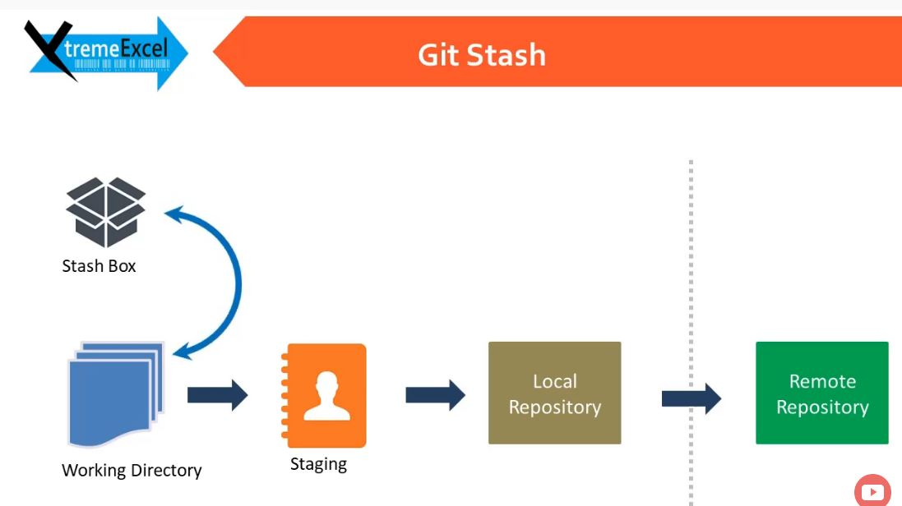

**1) How to remove a big file wrongly committed**

git filter-branch --tree-filter 'rm -rf AWS/storage/.terraform/' HEAD

**2) gitignore document**

https://www.atlassian.com/git/tutorials/saving-changes/gitignore

**3) github writing and formating**

[official documentation](https://help.github.com/en/github/writing-on-github/basic-writing-and-formatting-syntax#headings)

**4) Copy new folder/files to existing repo**

git add .

git commit -m "testing"

git remote add origin git@github.com:mehrotsh/terraformstuff.git

git pull --rebase origin master

git push origin master

**5) remove from remote but not from local**

git rm -r --cached hello removeme
 
git commit -m "remove only remote"

git push origin master

**6) git pull = git fetch + git merge***

[link to a tutorial video](https://www.youtube.com/watch?v=z2tYZmsO2eE)

**git fetch**
 Downloads commits, files, and refs from a remote repository into your local repo but it doesn’t force you to actually merge the changes into your repository. 
 
 **git diff master origin/master**  Lets you see the difference between local and remote repo  
 
 **git merge** Merges the changes to local
 
**7) git push**

Take changes from working copy to remote repo

 **8) git stash**
 
 It is used for putting changes from working directory to a stash box, instead of staging (git add) them for commit.
 
 
 
  **git stash save "1"**
  
  **git stash save "2"**
  
  stashes the change made on file in working directory
  
  **git stash list**
  
  list all the changes stashed
  
  **git stash apply stash@{1}
  
  apply all the stash to local working directory (it does not delete it from stash  *(you can still find it in git stash list)*  also you cannot apply another stash until you add the change made by previous stash apply command or you use git reset -hard to roll it back to previous state)
  **git stash pop**
  
  apply then removes last saved stash
  
  **git stash clear**
  
  clears the stash list
  
  
 
